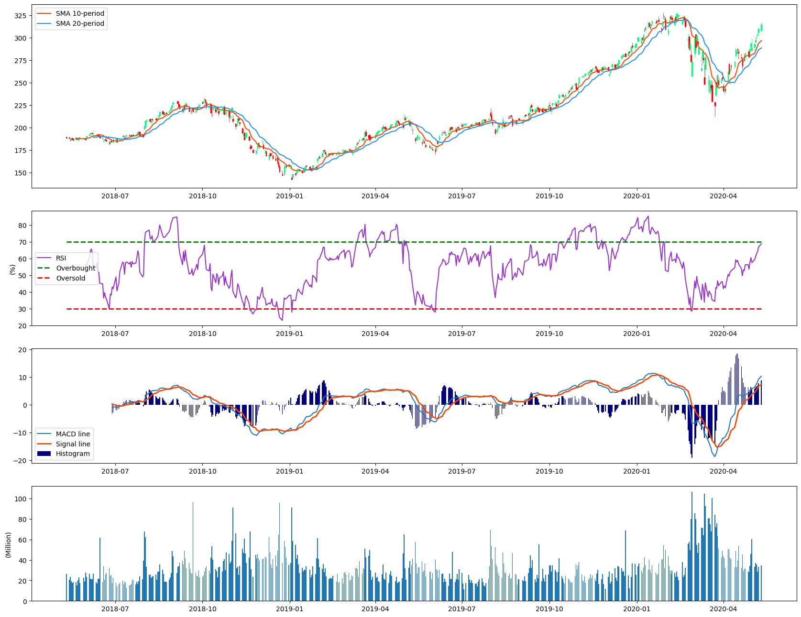

# Technical-Analysis-Stock-Market
Python v3.6.8

Perform a technical analysis on stock market data using several technical indicators such as Moving Averages, Relative Strength Index (RSI) and Moving Average Convergence Divergence (MACD). 
Moving averages: Used as lagged indicator for buy and sell signal, trend bias and can act as support and resistance levels.
RSI: Used as momentum indicator to indicate whether the stock is overbought or oversold within the time period.
MACD: Used as oscillator indicator to identify trend, reversal/changes in direction and momentum. It can also trigger buy and sell signal.

Example result:

Future work:

A good starting point to create simplistic chart for technical analysis in Python. A further idea is to develop some kind of notification system. For example, using the chart, I can make a potential buy or sell notification everytime these technical indicators trigger some events such as moving average crossover or overbought and oversold condition. Then the alert system will be build as an automated system, and so anytime a bug or sell signal happen, the user will be notified.

© 2020 Kevin Kurnia Santosa. All rights reserved.
